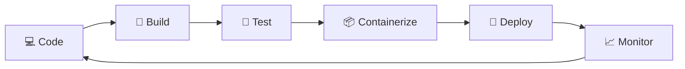

<!-- ============================================================
  GITHUB PROFILE README - DevOps edition
  Username used below: HassanAli70151539
  1) Replace everything in [brackets] with your own info.
  2) Delete any badge/tool you have NOT actually used yet.
  3) Add each project only when it really exists in your repos.
============================================================ -->

 

---

## 👋 About Me

I'm **Hassan Ali**, a **DevOps developer** who loves turning slow, manual, error-prone processes into fast, repeatable, automated ones. I care about reliable deployments, clean pipelines, and infrastructure you can rebuild from code in minutes.

- 🔭 Currently working on: **[your current project, e.g. CI/CD pipeline for a web app]**
- 🌱 Currently learning: **[e.g. Kubernetes, Terraform, AWS]**
- 🎯 Goal: **[e.g. Become a Cloud / DevOps Engineer]**
- 💬 Ask me about: **[e.g. Docker, Linux, GitHub Actions, Bash scripting]**
- ⚡ Fun fact: **[something fun about you]**

---

## 🔄 How I Work: The DevOps Loop

---

## 🛠️ DevOps Toolbox

**Containers & Orchestration**

**CI/CD**

**Infrastructure as Code & Config Management**

**Cloud**

**Monitoring & Observability**

**OS, Scripting & Web Servers**

---

## 🚀 Featured Projects

<table>
  <tr>
    <td width="50%" valign="top">
      <h3>🐳 Dockerized Calculator</h3>
      
A calculator app packaged with Docker and shipped through an automated GitHub Actions pipeline (build → test → push image).

      
<b>Tech:</b> <code>Docker</code> <code>GitHub Actions</code> <code>[App stack]</code>

      

        <a href="https://github.com/HassanAli70151539/calculator">📂 Source Code</a>
      

    </td>
    <td width="50%" valign="top">
      <h3>⚙️ CI/CD Pipeline</h3>
      
[Automated pipeline that builds, tests and deploys an app on every push to main.]

      
<b>Tech:</b> <code>[Jenkins / GitHub Actions]</code> <code>Docker</code>

      

        <a href="#">📂 Source Code</a>
      

    </td>
  </tr>
  <tr>
    <td width="50%" valign="top">
      <h3>🏗️ Infrastructure as Code</h3>
      
[Terraform / Ansible setup that provisions servers and configures them automatically.]

      
<b>Tech:</b> <code>Terraform</code> <code>Ansible</code> <code>[AWS]</code>

      

        <a href="#">📂 Source Code</a>
      

    </td>
    <td width="50%" valign="top">
      <h3>📈 Monitoring Stack</h3>
      
[Prometheus + Grafana dashboards tracking server and container health with alerts.]

      
<b>Tech:</b> <code>Prometheus</code> <code>Grafana</code> <code>Docker Compose</code>

      

        <a href="#">📂 Source Code</a>
      

    </td>
  </tr>
</table>

---

## 📊 GitHub Stats

 

---

## 🎯 Learning Roadmap

- [x] Git & GitHub fundamentals
- [ ] Linux administration & Bash scripting
- [ ] Docker & Docker Compose
- [ ] CI/CD with GitHub Actions / Jenkins
- [ ] Terraform & Ansible
- [ ] Kubernetes
- [ ] Cloud certification (**[e.g. AWS Cloud Practitioner]**)

---

## 🤝 Let's Connect

  

⭐ *Open to DevOps internships, collaborations and learning together!* ⭐

